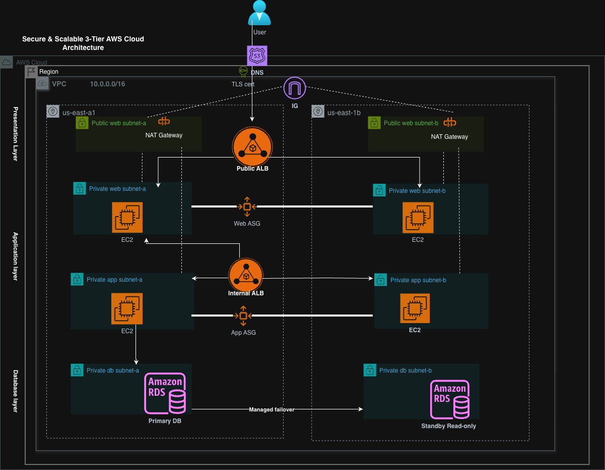

# Secure & Scalable 3-Tier AWS Cloud Architecture (Production-Grade, Multi-AZ)

Production-aligned **3-tier AWS architecture** designed for **high availability**, **secure subnet segmentation**, and **controlled egress**.  
Key services: **VPC**, **Route 53**, **ACM**, **Application Load Balancer (Public + Internal)**, **Auto Scaling Groups (ASG)**, **NAT Gateway (per AZ)**, and **Amazon RDS Multi-AZ**.

---

## Architecture Diagram

---

## Business Objective (Why this architecture)

This reference architecture models a common enterprise pattern for customer-facing, highly available applications where:

- The **web tier** must scale horizontally under variable traffic
- The **app tier** must remain private and isolated from direct internet access
- The **database tier** must support **automated failover** with minimal operational overhead
- Outbound internet access must be **controlled** (patching, package installs, external APIs) without exposing compute resources

This design is intentionally “production-grade” and interview-defensible.

---

## High-Level Traffic Flow

### Inbound (User Requests)

1. **User → Route 53** (DNS resolution)
2. **Route 53 → Public ALB** (HTTPS :443, TLS termination using **ACM**)
3. **Public ALB → Web Tier (ASG)** in **private web subnets** across two AZs
4. **Web Tier → Internal ALB**
5. **Internal ALB → App Tier (ASG)** in **private app subnets** across two AZs
6. **App Tier → Amazon RDS (Primary)** in isolated DB subnets

### Database Availability

- **Amazon RDS Multi-AZ** provides **managed failover** from primary to standby.

### Outbound (Egress)

- **Private Web/App subnets → NAT Gateway (per AZ) → Internet Gateway**
- **DB subnets have no internet route**

---

## Architecture Components

### Networking (VPC / Subnets / Routing)

- **VPC** spanning **2 Availability Zones**
- Per AZ:
  - **Public subnet** (NAT Gateway)
  - **Private web subnet**
  - **Private app subnet**
  - **Private DB subnet**
- **Internet Gateway (IGW)** attached at VPC level
- **NAT Gateway per AZ** for resilient outbound access (no single point of failure)

### Load Balancing

- **Public ALB (internet-facing)**: receives HTTPS traffic and load balances to Web Tier targets across AZs
- **Internal ALB (private)**: enforces tier isolation and routes traffic from Web Tier to App Tier

### Compute (Auto Scaling)

- **Web Tier ASG** in private subnets (no public IPs)
- **App Tier ASG** in private subnets (no public IPs)
- Stateless design assumptions for safe horizontal scaling

### Database

- **Amazon RDS Multi-AZ**
- DB deployed in isolated private DB subnets
- No public accessibility

---

## Security Model (Layered)

- **No public EC2 instances**
- Tier isolation enforced via **security groups** and **internal ALB**
- **TLS termination at Public ALB** using ACM certificate
- Controlled outbound access via NAT (Web/App only)
- Database tier isolated in private subnets with minimal inbound paths

---

## Design Decisions and Trade-Offs

### NAT Gateway per AZ

**Trade-off**: higher cost than a single NAT or NAT instance.  
**Benefit**: preserves outbound availability during a single-AZ failure and aligns with production HA expectations.

### Public + Internal ALB

**Trade-off**: additional hop and configuration complexity.  
**Benefit**: strong tier isolation, clearer security boundaries, easier policy enforcement.

### RDS Multi-AZ vs self-managed replication

**Trade-off**: less low-level control than self-managed.  
**Benefit**: reduced operational overhead, built-in failover, and predictable resiliency pattern.

---

## Implementation Notes (Production Mindset)

- Keep instances private and managed via IAM + management plane tooling (no inbound SSH exposure)
- Use CloudWatch for logs/metrics/alarms and ALB access logs where applicable
- Store secrets in AWS Secrets Manager or SSM Parameter Store (not in code)
- Enable encryption at rest for EBS/RDS and in transit for application paths

---

## Common Challenges Addressed (What reviewers usually look for)

- Correct modeling of **IGW as VPC-level** (not per AZ)
- Correct modeling of **NAT per AZ** for HA egress
- Separation of **data-plane traffic** (app flow) vs **egress flow** (patching/outbound)
- Clear tier isolation using an **internal load balancer**

---

## Lessons Learned (Architectural Insights)

- Clean separation of tiers improves security posture and reduces blast radius
- Egress routing is frequently misrepresented. Explicit NAT modeling prevents ambiguity
- Consistent labeling and arrow direction materially improves architectural communication in interviews

---

## Repository Contents

- `diagrams/` includes the source diagram (`.drawio`) and exported PNG
- `docs/` includes deeper technical notes:
  - `decisions.md` (trade-offs and design choices)
  - `ops-notes.md` (observability, security, and operations notes)
  - `teardown.md` (cost-control cleanup checklist)

---

## Recruiter Keywords (for searchability)

AWS VPC, Multi-AZ, Route 53, ACM, Application Load Balancer (ALB), Internal Load Balancer, Auto Scaling Group (ASG), Private Subnets, Public Subnets, NAT Gateway, Internet Gateway, Amazon RDS Multi-AZ, High Availability, Fault Tolerance, Secure Architecture, Tier Isolation, Controlled Egress.
